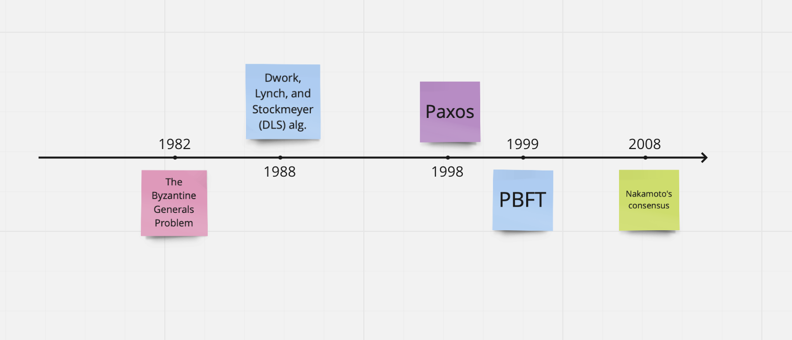

# Consensus Algorithms

## BGP
[Byzantine generals problem](https://en.wikipedia.org/wiki/Byzantine_fault)

## What "Consensus" is?
[Great video by Anytype - Consensus, pt.1](https://www.youtube.com/watch?v=WsvmbzouSzE):

Consensus means all parties agree on a particular decision. In the case of a blockchain network, members of the network arrive at a _consensus_ on the contents of the blockchain.

> Generally speaking, a consensus protocol enables a collection of networked nodes (computers) to agree on a collection of values (transactions), even if some nodes are faulty. In the blockchain space, the collection of values is typically a dynamically growing sequence of values (an append-only ledger). The essential security properties that any good consensus protocol should provide are **safety** and **liveness** ([link](https://www.shoup.net/papers/poh.pdf)).

* Safety means (roughly speaking) that all nodes agree on the same sequence of values (although at any instant in time, some nodes may only see a prefix of the sequence seen by other nodes);
* Liveness means (roughly speaking) that all honest (i.e., non-faulty) nodes make steady progress (to the extent that the network delivers messages sent between them).

## (Partially-syncronous) Crash Fault Tolerance vs (Partially-syncronous) Byzantine Fault Tolerance

The key difference is in the assumptions and threat/failure model, CFT can withstand up to N/2 system failures, while no guarantees on adversary nodes. BFT provides with guarantees to withstand and correctly reach consensus in presence of N/3 failures of any kind including Byzantine. 

Byzantine - components of the system may fail, and not just fail-stop — Byzantine-faulty nodes act arbitrarily and often present conflicting information to different nodes in the system.

> Hyperledger Fabric (PBFT/PoA) - The practical limit of peers depends on the network latency. The Hyperledger paper by Androulaki et al. has an evaluation up to 100 peers showing its performance in a WAN and a LAN environment ([link](https://dl.acm.org/doi/pdf/10.1145/3190508.3190538)).

### Byzantine Fault Tolerance

Byzantine Fault Tolerance is a property of a system - a system is said to be Byzantine Fault Tolerant if it can continue to operate even if certain participants drop out or are adversarial.

With respect to consensus algorithms, byzantine fault tolerance normally means the algorithm is guaranteed to converge, or capable of reaching consensus, even if there are adversarial nodes or if nodes drop from the network, etc. In this sense BFT is a property of a consensus algorithm rather than an algorithm itself.

## Practical BFT (PBFT)

PBFT uses a three-phase state machine and a block election to select the leader. The three phases of PBFT are known as pre-prepare, prepare, and commit. Where In the usual case, consensus is achieved by exchanging messages among nodes that brings a progressive transition to their local state. Otherwise, in the case of node failure, a ‘view-change’ will be triggered, leading to a re-selection of the leader in a round-robin manner. PBFT is able to handle less than ⅓ of Byzantine faults, this can be seen as 3f+1= Total nodes where f=amount of Byzantine faults.

**Drawbacks**: low network scalability – due to the high communication overhead and latency of multiple message rounds, scaling up the number of nodes would also increase the system’s complexity quadratically. 

**PBFT use case**: consortium blockchain with a limited authorised validator.

Nakamoto's Consensus scales much better, it can be used with millions of nodes and without permissioned list of nodes.

## Nakamoto's consensus/Proof-of-Work (PoW)

### PoW is a Sybil-control mechanism

People think that PoW and PoS are consensus protocols, and that they are the only two consensus protocols out there.
Proof-of-Work and Proof-of-Stake are ****sybil control mechanisms****. PoS doesn't achieve consensus by itself. It has to be coupled with a protocol, such as PBFT, or Ben-Or, or Tendermint/Cosmos, or Avalanche, to make decisions.

**PoW**, by itself, isn't a consensus mechanism. In Bitcoin and Ethereum, it works with the heaviest/"longest" chain selection rule to achieve consensus.

## Proof-of-Authority (PoA)

Proof-of-Authority (PoA) is a new family of Byzantine fault-tolerant (BFT) consensus algorithms largely used in practice to ensure better performance than traditional Practical Byzantine Fault Tolerance (PBFT). 

The analysis advocates that PoA for permissioned blockchains, deployed over the Internet with Byzantine nodes, do not provide adequate consistency guarantees for scenarios where data integrity is essential. **We claim that PBFT can fit better such scenarios, despite a limited loss in terms of performance.**

The Proof of Authority model relies on a limited number of block validators and this is what makes it a highly scalable system. Blocks and transactions are verified by pre-approved participants, who act as moderators of the system.

## Proof-of-Stake (PoS)

Bitcoin was the first truly permissionless consensus protocol, and is based on a proof of work. In a permissionless protocol, there really is no access structure — nodes are free to join the network and participate in the protocol without precondition or permission. 

In recent years, a compromise approach, called proof of stake, has emerged. In this approach, the access structure of the protocol is dynamically determined by a decentralized mechanism based on staking cryptocurrency in the network. 

A proof-of-stake consensus protocol allows the access structure of the protocol to change over time; however, at distinct intervals in time, it typically employs what is essentially a **permissioned** consensus protocol, with the access structure for the protocol at each interval determined by a decentralized staking mechanism. 

Conversely, a permissioned consensus protocol can typically be converted to one based on proof of stake, simply by using a decentralized staking mechanism to define the access structure for the protocol at different intervals in time.
