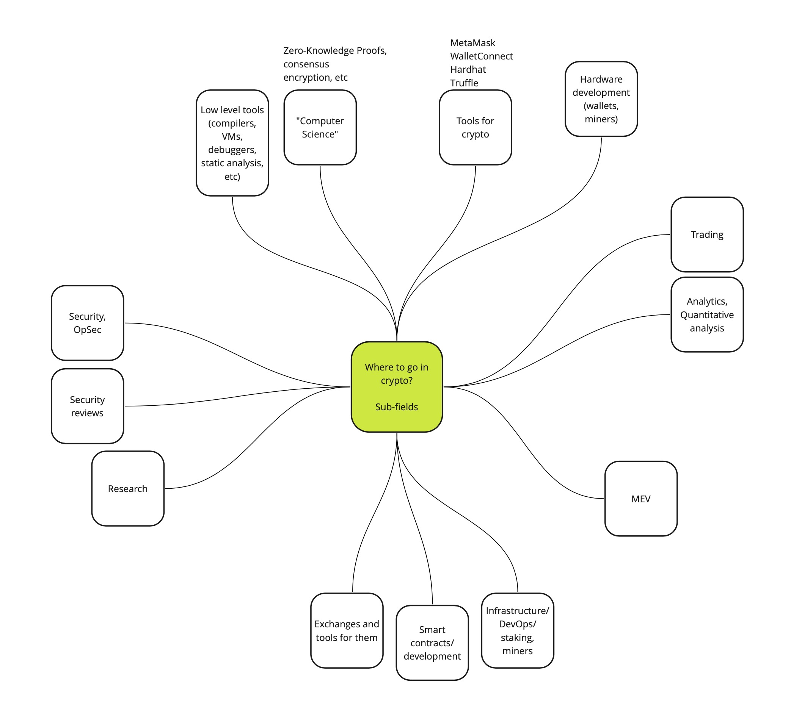
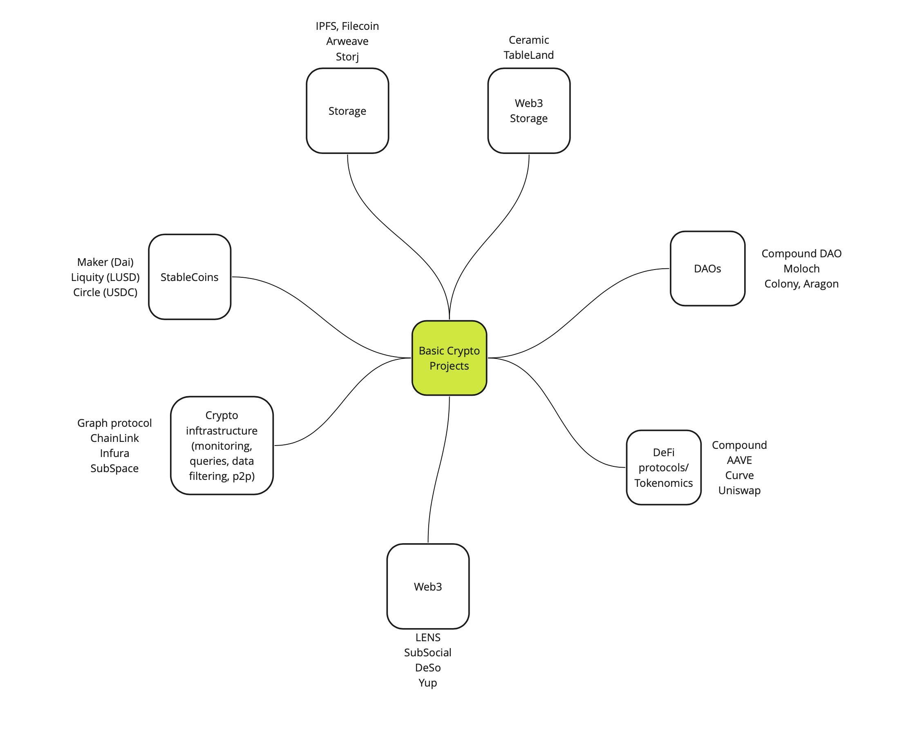

# Welcome to Crypto (by [Anytype](https://anytype.io))
This is a curated list of different crypto resources that will help you dive into the Crypto space.

**Beware**: it's mainly an Ethereum-centric list of resources. And it is for super beginners only!

## Curators
* [Anton Kent](http://github.com/AnthonyAkentiev)

## Best podcasts 
1. [Bankless podcast](http://podcast.banklesshq.com)
1. [Unchained](https://unchainedpodcast.com)
1. [Empire](https://blockworks.co/podcasts/empire/)
1. [UpOnly](https://www.twitch.tv/uponlytv)
1. [Epicenter](https://epicenter.tv)
1. [Tokenomics DAO Podcast](https://podcasts.apple.com/us/podcast/tokenomics-dao-podcast/id1612644466)
1. [Web3 with a16z](https://a16zcrypto.com/web3-with-a16z-podcast/)
1. [Green Pill](https://www.thegreenpillpodcast.com/episodes)

## Best blogs
1. [Vitalik’s Blog](https://vitalik.ca)
1. [Ethereum Magicians](https://ethereum-magicians.org)

## Best Youtube channels
1. [Economics Design](https://www.youtube.com/c/economicsdesign)

## Where to go in crypto (for devs)? 

## Major crypto projects

# Table of Contents
* [1-basics.md](1-basics.md)
* [2-solidity.md](2-solidity.md)
* [3-protocols.md](3-protocols.md)
* [4-daos.md](4-daos.md)
* [5-tokenomics.md](5-tokenomics.md)

